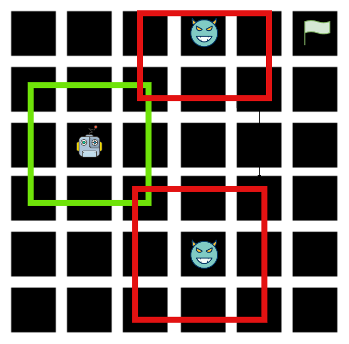

# Problem Statement
Robot motion planning in a square grid with moving obstacles by using Z3 solver.

# Solution Approach

We abstract the problem into finding the intersection of 
boundaries between obstacles and robots to avoid collision.

Each robot and obstacle in the workspace has a surrounding set of grid points that it can move to.The goal of the robot is to find a path to the destination such that these regions does not intersect. 

The robot does not need to consider obstacles outside its range of motion. It makes a plan to the destination considering its immediate neighbourhood and assumes that all other grid points are free.

On each step it checks whether its next step falls in the immediate neighbourhood of an obstacle. If there is no intersection then the robot continues on the pre-calculated path. Else, the path is recalculated marking these grid points as unreachable in the next step.

In the case that the current set of constraints cannot be satisfied the robot stays in the current position till the obstacle moves out of the way. Note that if the obstacles moves into the robot there could be cases where there is no way to avoid collision.

 
